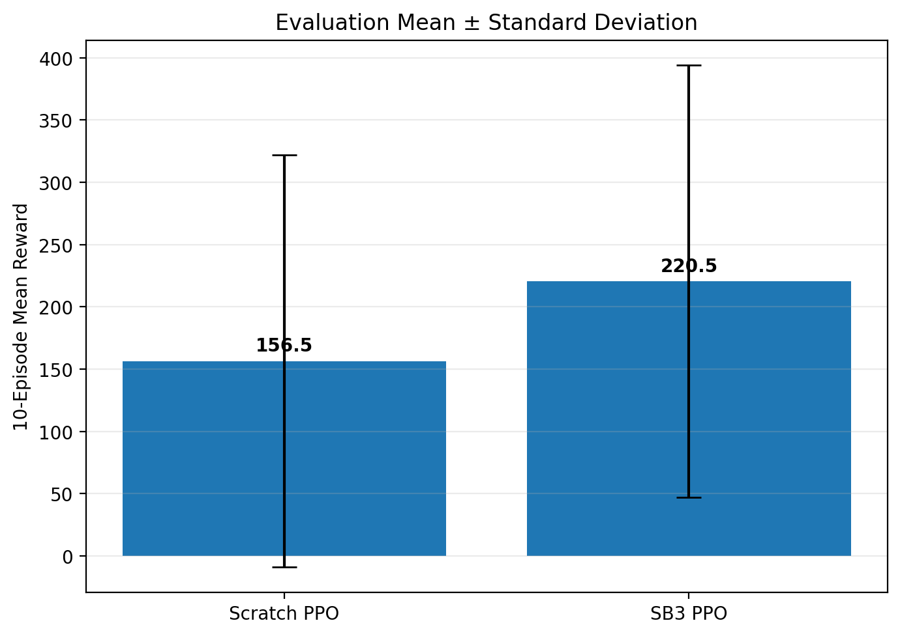
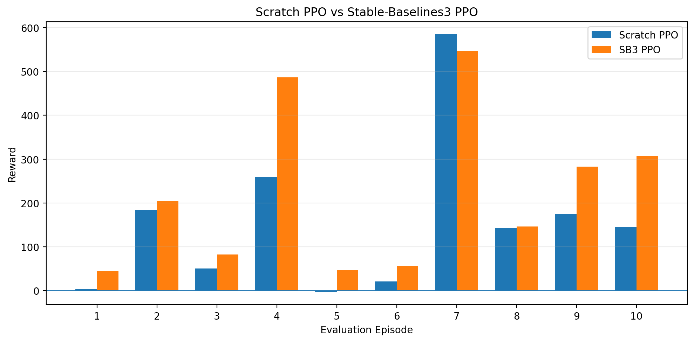
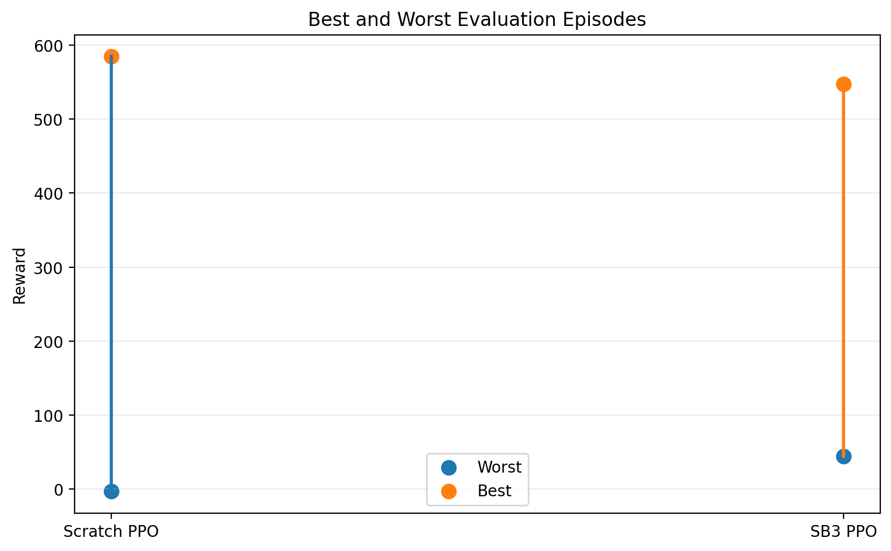

# PPO for CarRacing-v3 — From Scratch vs Stable-Baselines3

A reinforcement-learning project implementing **Proximal Policy Optimization (PPO) from scratch in PyTorch** for Gymnasium's `CarRacing-v3`, then comparing it against a **Stable-Baselines3 PPO** baseline.

The project focuses not only on final reward, but also on PPO implementation details, checkpoint selection, seed sensitivity, training instability, and qualitative driving behavior.

## Results

Both agents were evaluated deterministically on the same 10 fixed evaluation tracks.

| Metric | Scratch PPO | Stable-Baselines3 PPO |
|---|---:|---:|
| Selected training checkpoint | 200,704 steps | ~300,000 steps |
| Mean reward | **156.5** | **220.5** |
| Standard deviation | 165.3 | 173.6 |
| Best episode | **584.4** | 547.5 |
| Worst episode | -2.7 | **44.4** |

SB3 achieved the stronger **average and worst-case performance**, while the custom Scratch PPO achieved the **highest individual evaluation score**.



### Episode-by-episode evaluation



### Best vs worst performance



## Scratch PPO

The custom implementation includes:

- CNN actor-critic network
- continuous Gaussian action policy
- four-frame grayscale observation stack
- Generalized Advantage Estimation (GAE)
- PPO clipped surrogate objective
- value-function loss and entropy regularization
- frozen old-policy snapshot for PPO updates
- minibatch optimization
- 16 parallel CarRacing environments
- learning-rate decay
- checkpointing and resume support

The implementation is a modern **PyTorch + Gymnasium `CarRacing-v3` port inspired by the supplied `elsheikh21/car-racing-ppo` reference**, whose original implementation targets TensorFlow 1.x and older Gym/CarRacing APIs.

### Checkpoint selection

Scratch PPO performance was strongly non-monotonic. Evaluating saved checkpoints on the same fixed tracks gave:

| Checkpoint | Mean reward | Std. dev. | Best |
|---|---:|---:|---:|
| 151k | 53.8 | 99.1 | 250.2 |
| **200k** | **156.5** | **165.3** | **584.4** |
| 251k | 67.2 | 102.2 | 268.9 |

The 200,704-step checkpoint was therefore selected instead of simply using the latest model.

During training, the rolling reward reached above 300 in the strongest phase. The later decline illustrates why checkpoint selection matters in reinforcement learning.

## Stable-Baselines3 Baseline

The baseline uses Stable-Baselines3 PPO on the same `CarRacing-v3` task and compatible visual preprocessing/frame stacking.

Across the fixed 10-track evaluation it achieved:

- **Mean:** 220.5
- **Standard deviation:** 173.6
- **Best:** 547.5
- **Worst:** 44.4

All ten SB3 evaluation episodes produced positive reward, giving it better overall consistency than the custom implementation.

## Gameplay

### Scratch PPO

Selected checkpoint: **200,704 steps**  
10-track mean: **156.5**  
Best evaluation episode: **584.4**

The demo policy successfully negotiates multiple corners and demonstrates recovery after leaving the ideal racing line, although it remains inconsistent on some larger/sharper turns.

[▶ View Scratch PPO gameplay](media/scratch_ppo_demo.mp4)

### Stable-Baselines3 PPO

Training: **~300k steps**  
10-track mean: **220.5**  
Best evaluation episode: **547.5**

[▶ View SB3 PPO gameplay](media/sb3_ppo_demo.mp4)


## Key Findings

1. **PPO can be implemented successfully from scratch for a high-dimensional continuous-control task.**
2. **SB3 was more consistent.** Its higher mean and positive worst-case evaluation show the benefit of a mature implementation.
3. **The Scratch agent was competitive on some tracks.** Its best evaluation reward of 584.4 exceeded the SB3 best of 547.5.
4. **More training was not automatically better.** Scratch evaluation peaked around the 200k checkpoint and degraded later.
5. **Random seed mattered substantially.** A second clean Scratch run produced a much stronger learning trajectory than the first.
6. **Checkpoint evaluation matters.** Selecting models using fixed evaluation tracks was more reliable than simply choosing the final training state.
7. **Training reward and generalization are different.** A high rolling training reward did not guarantee equivalent performance on unseen/fixed evaluation tracks.

## Repository Structure

```text
CarRacing-PPO/
├── README.md
├── requirements.txt
├── notebooks/
│   ├── 01_scratch_ppo.ipynb
│   └── 02_sb3_baseline.ipynb
├── results/
│   ├── evaluation_episode_comparison.png
│   ├── mean_std_comparison.png
│   └── best_worst_comparison.png
└── media/
    ├── scratch_ppo_demo.mp4
    └── sb3_ppo_demo.mp4
```

## Notebooks

### `01_scratch_ppo.ipynb`
Complete custom PPO implementation, preprocessing, parallel training, checkpointing, checkpoint selection, final evaluation, plots, and gameplay generation.

### `02_sb3_baseline.ipynb`
Stable-Baselines3 PPO baseline training, resume workflow, final evaluation, plots, and gameplay generation.

## Setup

Python 3.10+ is recommended.

```bash
pip install -r requirements.txt
```

For Colab, a GPU runtime is recommended for training.

## Reproducibility

Reinforcement learning is stochastic. Results can vary across random seeds, hardware, environment versions, and parallel-environment execution.

The reported final metrics use fixed evaluation seeds so the selected Scratch checkpoint and SB3 baseline are compared on the same set of tracks.

## References

- Schulman et al., **Proximal Policy Optimization Algorithms** (2017)
- Gymnasium `CarRacing-v3`
- Stable-Baselines3 PPO
- `elsheikh21/car-racing-ppo` — reference implementation used to guide the modern Scratch PPO port
- NotAnyMike, **Solving CarRacing**
